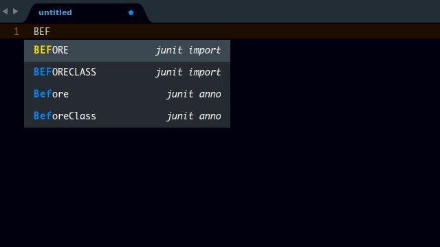

# JUnit Completions

## About

A sublime text completion package for JUnit

## Screenshot

## How to Use

### Example
#### Import
> Note you can also press ENTER rather than TAB

Type the JUnit class name in *(uppercase)*. Suggestions should already be popping up then press *TAB* to select. The package will be automatically imported.

#### Methods, Interfaces etc.

completions pop up by default as you type so you can just press TAB or ENTER.

> **Note:** For a cleaner interface, disable JUnit when not needed.

## Installation
> Important: You need to have `Package Control` installed first on your sublime text which can be found at [The Package Contol Website](http://packagecontrol.io)

### Using Package Control's Repository

Go to `Preferences` --> `Package Control` --> `Add Repository` --> then type into the textbox `https://github.com/tushortz/JUnit-Completions`

After doing this, then go to: `Preferences` --> `Package Control` --> `Install Package` --> then search `JUnit Completions` and click it.

The package will be installed and ready for use.

### Download Manually

* Download the files using the GitHub .zip download option
* Unzip the files
* Copy the folder to your Sublime Text `Packages` directory

## Contributing

All contributions are welcome. fork it on [Github](https://github.com/tushortz/JUnit-Completions) and create a `pull` request. Any suggestions or bugs, please let me know.

## License
© 2016 Taiwo Kareem | taiwo.kareem36@gmail.com.

Read **license.txt**

## Acknowledgements
I'd first like to say a very big thank you to God my creator. Without him, this wouldn't be possible.

